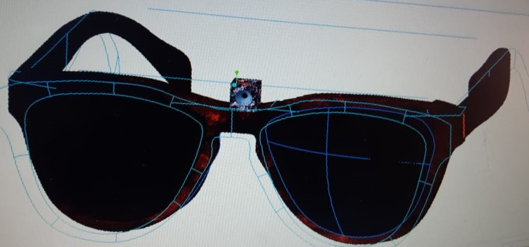
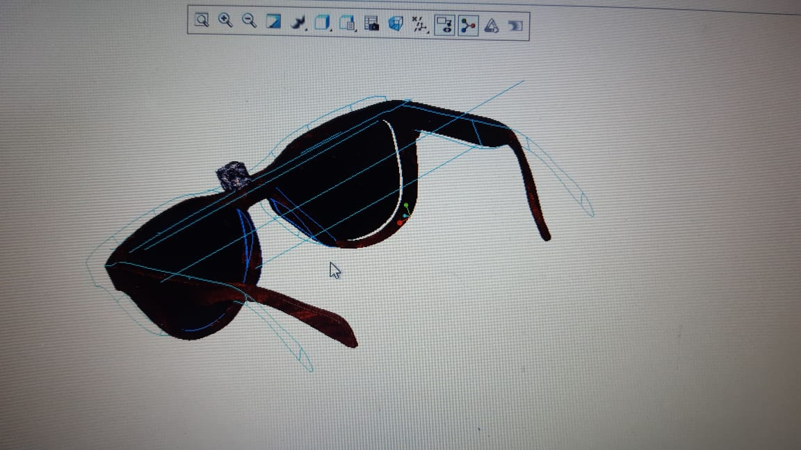

# glasses-to-aid-the-blind

in this project, I decided to make the program which can help the blind to recognize the person, objects and then tell the blind person in the ear through ear piece what was detected. 

the goggles 3D model that I created will look like this.

This program right now can recognize the registered person, detect 80 different objects: 
    person 
    bicycle 
    car 
    motorbike 
    aeroplane 
    bus 
    train 
    truck 
    boat 
    traffic light 
    fire hydrant 
    stop sign 
    parking meter 
    bench 
    bird 
    cat 
    dog 
    horse 
    sheep 
    cow 
    elephant 
    bear 
    zebra 
    giraffe 
    backpack 
    umbrella 
    handbag 
    tie 
    suitcase 
    frisbee 
    skis 
    snowboard 
    sports ball 
    kite 
    baseball bat 
    baseball glove 
    skateboard 
    surfboard 
    tennis racket 
    bottle 
    wine glass 
    cup 
    fork 
    knife 
    spoon 
    bowl 
    banana 
    apple 
    sandwich 
    orange 
    broccoli 
    carrot 
    hot dog 
    pizza 
    donut 
    cake 
    chair 
    sofa 
    pottedplant 
    bed 
    diningtable 
    toilet 
    tvmonitor 
    laptop 
    mouse 
    remote 
    keyboard 
    cell phone 
    microwave 
    oven 
    toaster 
    sink 
    refrigerator 
    book 
    clock 
    vase 
    scissors 
    teddy bear 
    hair drier 
    toothbrush 
 

we will be using   
1- A pair of glasses 
2- A raspberry pi  
3- 3mm camera 
4- headphones/ear piece 
 
to make this program work you will be needing three files named as "yolov3.cfg", "coco.names" and "yolov3.weights".  I have attached two file named as "yolov3.cfg" and "coco.names" here and other file named as "yolov3.weights" you can download from https://drive.google.com/open?id=1-e8s1mF_QAlGSRbBX3b0JcWmWQtmVjNe

this project is still in progress phase.
will appriciate any kind of help in coding.
